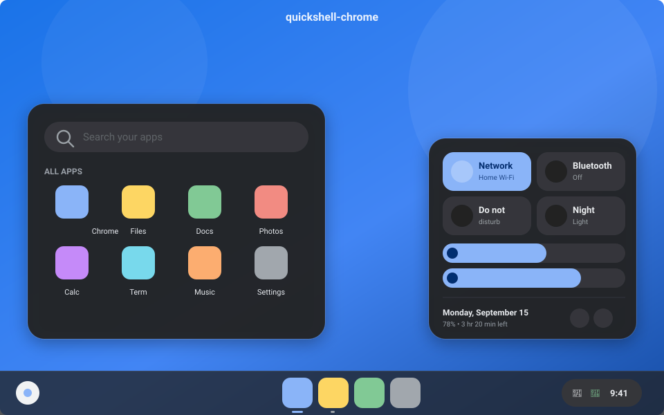

# quickshell-chrome

A **Chrome OS–style desktop shell** built with [Quickshell](https://quickshell.outfoxxed.me/).
It gives any wlroots-based Wayland compositor (Hyprland, Sway, niri, river, …) the
look and feel of Chrome OS: the translucent **shelf** at the bottom, the round
**launcher** button, a searchable **app launcher**, and a **quick settings**
bubble with network / bluetooth toggles and brightness / volume sliders.



## Features

- **Shelf** — full-width translucent bottom bar
  - Round Chrome OS launcher button (white circle + blue dot)
  - Centered pinned apps with hover pills, tooltips and running-window indicators
  - Right-hand **status area** pill (bluetooth · network · battery · clock)
- **App launcher** — bubble launcher above the launcher button
  - Instant search across all installed `.desktop` apps
  - Scrollable icon grid, `Enter` launches the top hit, `Esc` closes
- **Quick settings** — bottom-right system bubble
  - Feature pods: Network (Wi-Fi), Bluetooth, Do Not Disturb, Night Light
  - Inline **Wi-Fi** (scan + connect), **Bluetooth** (connect / disconnect),
    **Night Light** (colour-temperature slider) and **audio-output** picker
    panels — tap a pod / the speaker button to expand
  - Brightness slider (`brightnessctl`) and volume slider (PipeWire)
  - Footer with date, battery status and Settings / Lock / Power buttons
- **Notifications** — a desktop notification server with ChromeOS-style toast
  cards (bottom-right, auto-dismiss), a standalone **notification center**
  panel (its own bubble, not merged into quick settings) opened by the
  status-area bell with an unread count, and Do-Not-Disturb
- **On-screen display** — a volume / brightness OSD pill that pops on change
- **Calendar** — click the clock for a month view popup
- **Base16 theming** — the whole palette is driven by a Base16 colors file and
  live-reloads, so `flavours apply <scheme>` re-themes the shell instantly
- Material 3 motion — ripples, state layers, spring pop-in animations
- Multi-monitor aware — a shelf per screen; popups open on the active screen only

## Requirements

- **Quickshell** (recent build) running on Qt **6.7+**
- A **wlroots**-based Wayland compositor (uses `wlr-layer-shell`)
- Fonts (family names are set in `config/Theme.qml`; adjust if fontconfig lists
  them differently):
  - **JetBrains Mono Nerd Font** — UI text (`fontFamily`). Verify with
    `fc-list | grep -i jetbrains`.
  - **Material Symbols Rounded** — icons (`iconFamily`). Install the *variable*
    font so filled icons work (`ttf-material-symbols-variable`, or the
    `MaterialSymbolsRounded[FILL,GRAD,opsz,wght].ttf` from
    [fonts.google.com/icons](https://fonts.google.com/icons)), then `fc-cache -f`.
    Filled icons use the `FILL` axis, which needs Qt **6.7+**.
- Optional CLI tools (each feature degrades gracefully if missing):
  - `brightnessctl` — brightness slider
  - `nmcli` (NetworkManager) — network status & Wi-Fi toggle
  - `bluetoothctl` (BlueZ) — bluetooth status & toggle
  - `wlsunset` — Night Light
  - PipeWire + WirePlumber — audio

The battery, audio and system-tray data come from Quickshell's built-in
services (UPower / PipeWire), so no extra polling scripts are needed.

## Install

```sh
# 1. Clone into your Quickshell config directory
git clone https://github.com/pamanloki/quickshell-chrome \
  ~/.config/quickshell/chrome

# 2. Launch it
qs -c chrome
```

Or run it straight from a checkout without installing:

```sh
qs -p /path/to/quickshell-chrome/shell.qml
```

To start it with your session, add `qs -c chrome &` to your compositor's
autostart (e.g. Hyprland `exec-once = qs -c chrome`).

## Configuration

Everything is plain QML — edit and it hot-reloads.

| What | Where |
|------|-------|
| Colors, radii, fonts, motion | `config/Theme.qml` |
| Pinned shelf apps | `config/Pinned.qml` |
| Global open/close state | `config/State.qml` |
| System integrations | `services/*.qml` |
| Widgets | `components/*.qml` |

**Pin your own apps** straight from the shelf: **right-click** a running app's
icon and choose *Add to Dock*, or right-click a pinned icon and choose *Remove
from Dock*. The list is persisted to
`$XDG_STATE_HOME/quickshell-chrome/dock_pinned.json` and starts empty. Left-click
launches a pinned app (or focuses it if already running); running apps that
aren't pinned appear after a divider with a running dot.

## Theming (Base16)

`config/Theme.qml` loads a Base16 palette (`base00`–`base0F`) from a colors file
and derives every semantic token from it, so switching schemes re-themes
everything live. By default it reads `~/.config/waybar/colors.css` — the same
file [Flavours](https://github.com/Misterio77/flavours) generates — matching
lines like `@define-color base0D #7cafc2;`. Point it elsewhere with the
`QUICKSHELL_BASE16` env var. If the file is missing, a built-in "Default Dark"
palette is used. `base0D` is the accent (Chrome OS blue by default).

## Project layout

```
shell.qml              # entry point — spawns a Shelf + OverlayHost per screen
config/
  Theme.qml            # design tokens (Material 3 / Chrome OS palette)
  ShellState.qml       # shared UI state (which overlay is open, dock menu)
services/
  Time.qml Audio.qml Battery.qml Brightness.qml
  Network.qml Bluetooth.qml Nightlight.qml Notifications.qml
  Apps.qml DockConfig.qml            # persisted pinned apps
components/
  Shelf.qml            # the bottom bar
  LauncherButton.qml StatusArea.qml ShelfApp.qml
  OverlayHost.qml      # lazily creates the on-demand overlays per screen
  Launcher.qml         # fullscreen app search
  QuickSettings.qml    # system bubble (pods, panels)
  NotificationCenter.qml   # standalone notification panel (status-area bell)
  Calendar.qml         # month-view popup (click the clock)
  DockMenu.qml         # dock right-click Add/Remove from Dock
  Toasts.qml           # notification toasts
  Osd.qml              # volume / brightness on-screen display
  QsToggle.qml QsSlider.qml QsIconButton.qml
  MaterialIcon.qml StateLayer.qml   # primitives
```

## Notes / troubleshooting

- **Text shows as boxes** → JetBrains Mono Nerd Font isn't installed, or is
  registered under a different family name than `config/Theme.qml` expects.
- **Icons show as boxes or the ligature text** → Material Symbols Rounded isn't
  installed (check `fc-list | grep -i "material symbols rounded"`).
- **Icons never look filled** → install the *variable* Material Symbols font and
  make sure Qt is 6.7+ (the `FILL` axis needs `font.variableAxes`).
- **Every icon is a blank tile** in the launcher → your icon theme is missing;
  set one with your DE tools or install e.g. `papirus-icon-theme`.
- **Nothing appears** → make sure your compositor supports `wlr-layer-shell`
  and that `qs` reports no QML errors in the terminal.

## License

MIT
